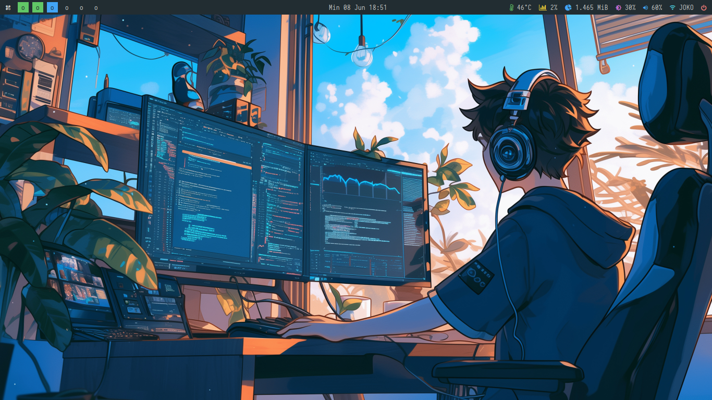

# simple-bspwm-dotfiles
My personal Arch Linux - BSPWM config files

<!-- # 🍚 dotfiles -->

<h4 align="center">A minimal bspwm setup built on top of <a href="https://wiki.archlinux.org/title/Installation_guide" target="_blank">Archlinux</a>.</h4>

## Information

* OS - [Arch](https://archlinux.org)
* WM - [Bspwm](https://github.com/baskerville/bspwm)
* Bar: [Polybar](https://github.com/polybar/polybar)
* Launcher : [Rofi](https://github.com/davatorium/rofi)
* Terminal: [Kitty](https://github.com/kovidgoyal/kitty)
* Themes manager: lxappearance-gtk3.
* Lockscreen - [Betterlockscreen] (https://github.com/betterlockscreen/betterlockscreen)

